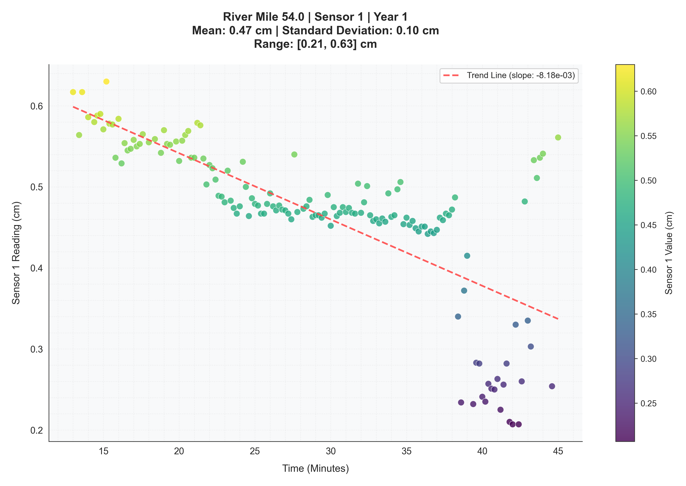
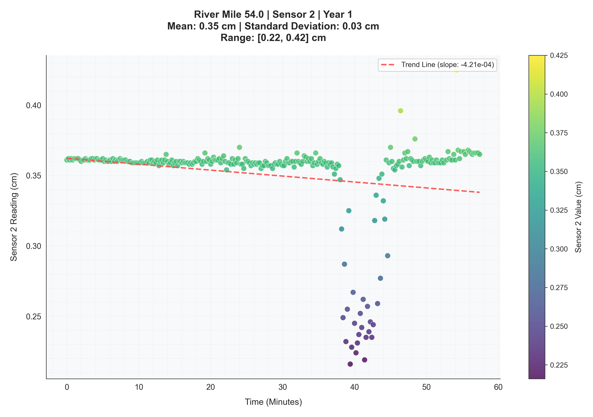

# Hydrograph vs Seatek Sensors Project


## Introduction
This project analyzes and visualizes Seatek sensor data collected from various river miles over a 20-year period (1995-2014). The project processes data from Excel files containing sensor readings to generate detailed visualizations and statistical insights.

## Overview
This project analyzes sediment bed levels and hydrograph data for various River Miles (RMs) along a river system.

## Quick Navigation
- [Installation Guide](docs/installation.md)
- [Data Format Specification](docs/technical/data_format.md)
- [Technical Documentation](docs/technical/Technical%20Documentation)
- [Sensor Analysis Documentation](docs/visualization/sensor_analysis.md)
- [Contributor Code of Conduct](https://github.com/abhimehro/Hydrograph_Versus_Seatek_Sensors_Project/blob/main/docs/CODE_OF_CONDUCT.md)

## Project Structure
```
Hydrograph_Versus_Seatek_Sensors_Project/
├── src/ # Source code
│ └── sensor-visualization.py
├── data/ # Data files
│ ├── raw/
│ └── processed/
├── output/ # Generated visualizations
│ └── RM_*/ # River mile outputs
│ └── sensor_charts/ # Sensor analysis outputs
├── docs/ # Documentation
│ ├── installation.md
│ ├── sensor_analysis.md
│ ├── data_format.md
│ └── visualization_guide.md
├── tests/ # Unit tests
├── requirements.txt # Core dependencies
└── requirements-dev.txt # Development dependencies
```

## Quick Start

1. **Clone and Setup**
   ```bash
   git clone https://github.com/abhimehro/Hydrograph_Versus_Seatek_Sensors_Project.git
   cd Hydrograph_Versus_Seatek_Sensors_Project
   python -m venv venv
   source venv/bin/activate  # On Windows: venv\Scripts\activate
   pip install -r requirements.txt
   ```

2. **Run Analysis**
   ```bash
   python src/sensor-visualization.py
   ```

3. **View Results**
  - Check output/ and/or src/output directories for generated visualizations
  - Each river mile has its own subdirectory with sensor-specific analysis
  
## Example Visualizations

Here are some sample charts generated by the project:

### Sensor 1 Hydrograph Versus Seatek Analysis Visualization


### Sensor 2 Hydrograph Versus Seatek Analysis Visualization


For more visualizations, check the respective directories in the `output` folder.

### Sensor 1 Analysis Visualization


### Sensor 2 Analysis Visualization


For more visualizations, check the `src/output/sensor_charts` directory specific to each river mile.

## Key Features
- Multi-sensor time series analysis
- Statistical insights and trend analysis
- Professional-grade visualizations
- Automated data validation and processing
- Configurable output formats

## Core Dependencies
- Python ≥ 3.9
- pandas ≥ 2.2.3
- matplotlib ≥ 3.7.3
- numpy ≥ 2.2.0
- seaborn ≥ 0.13.0

## License
This project is licensed under the MIT License - see [LICENSE](LICENSE) for details.

## Contact & Support
- **Author**: Abhi Mehrotra
- **Email**: abhimhrtr@pm.com
- **Issues**: [GitHub Issues](https://github.com/abhimehro/Hydrograph_Versus_Seatek_Sensors_Project/issues)
